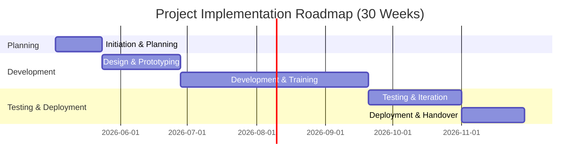

# Implementation Plan: Machine Learning-Based System for Cardiopulmonary Sound Separation

## Executive Summary
This plan defines how to build and deploy a **Python-based prototype** that separates mixed chest audio into distinct **heart** and **lung** sounds using **NeoSSNet** (Conv-TasNet style). The delivery approach is phased, risk-aware, and quality-driven.

Core recommendations:
- Use a **layered, modular architecture** with Strategy, Abstract Factory, and Observer patterns.
- Deliver in **iterative phases** (initiation → design/prototyping → development → testing → deployment).
- Define ownership with a **RACI matrix**.
- Track progress using **technical + project KPIs**.
- Enforce structured **change management, QA, and handover**.

---

## 1) Objectives and Scope
### Objective
Develop an ML component that:
1. Accepts mixed cardiopulmonary audio.
2. Outputs separated heart and lung signals.
3. Supports downstream clinical/analytics workflows.

### Scope (Prototype)
- Data collection and preprocessing pipeline.
- NeoSSNet training and validation.
- Integration into a layered software architecture.
- API and/or basic UI access for inference.
- QA, documentation, and handover.

---

## 2) Architecture and Design Principles
### Architectural style
- **Layered architecture** to separate concerns (data, model, orchestration, interface).
- **Design patterns**:
  - **Strategy**: interchangeable model/inference strategies.
  - **Abstract Factory**: consistent creation of data/model components.
  - **Observer**: event-driven status notifications (training, inference, QA events).

### Expected benefits
- Easier upgrades (new model versions, pipeline modules).
- Better testability and maintainability.
- Reduced coupling across functional modules.

---

## 3) Stakeholders and Responsibilities
### Key roles
- **Project Sponsor / Clinical Lead**: vision, funding, approvals.
- **Project Manager**: schedule, scope, risk, communication.
- **Data Scientist / ML Engineer**: data pipeline, model development.
- **Software Engineer**: integration, API/UI, deployment packaging.
- **QA/Test Engineer**: test strategy, execution, validation sign-off.
- **Clinical Domain Expert** (part-time): medical validation and feedback.

### RACI Matrix
| Task | Sponsor | Project Manager | Data Scientist | Software Engineer | QA/Test | Clinician |
|---|---|---|---|---|---|---|
| Define requirements & scope | I/A | R | C | C | C | C |
| System architecture design | I | A/R | C | C | C | C |
| Data collection & preprocessing | I | R | A/R | C | C | C |
| Model development & training | I | R | A/R | C | C | C |
| Software development | I | R | C | A/R | C | C |
| Testing & QA | I | R | C | C | A/R | C |
| Deployment & handover | I/A | R | C | C | C | C |

> Guideline: assign exactly one **Accountable** owner per task.

---

## 4) Resource Plan
### Team composition (typical)
- Project Manager: 1
- Data Scientist/ML Engineer: 1–2
- Software Engineer: 1–2
- QA Engineer: 1
- Clinical Advisor: part-time

### Tools and platforms
- Python, PyTorch/TensorFlow, Librosa/PyAudio.
- Git + issue tracker (GitHub/Jira).
- Documentation workspace (Confluence or equivalent).
- GPU compute + storage (cloud or on-prem).

### Budget (R&D estimate)
- Personnel (6–12 months): **$100K–$200K**
- Compute/storage: **$5K–$10K**
- Data/licensing/misc: **$5K–$10K**
- Contingency reserve: **10–20%**

---

## 5) Implementation Roadmap
## Phase 1 — Initiation & Planning (Weeks 1–3)
- Kickoff, scope/KPI finalization, governance setup.
- Deliverables: project charter, signed requirements.

## Phase 2 — Design & Prototyping (Weeks 4–8)
- Architecture definition, framework selection, proof-of-concept model run.
- Deliverables: architecture docs, prototype code, initial metrics.

## Phase 3 — Development & Training (Weeks 9–20)
- Data pipeline implementation, model training, software integration.
- Milestone: core separation working on test set.

## Phase 4 — Testing & Iteration (Weeks 21–26)
- Unit/integration/regression testing, model tuning, clinician review.
- Deliverables: QA report, tuned model, sign-off readiness.

## Phase 5 — Deployment & Handover (Weeks 27–30)
- Packaging, documentation, training, operational transition.
- Milestone: pilot deployment and formal handover.

### High-level Gantt (Mermaid)


---

## 6) Risk Register (Initial)
| Risk | Likelihood | Impact | Mitigation |
|---|---|---|---|
| Data quality/availability | High | High | Multi-source data, augmentation, early pilot |
| Model underperformance | Medium | High | Iterative tuning, fallback baseline model |
| Schedule delay | Medium | Medium | Buffers, milestone tracking, early prototyping |
| Budget overrun | Medium | Medium | Monthly review, contingency reserve |
| Stakeholder misalignment | Medium | High | Structured communication cadence |
| Integration issues | Low | Medium | Modular design, integration test gates |

---

## 7) KPIs and Success Metrics
### Technical KPIs
- Separation quality target (e.g., significant SNR improvement on validation set).
- Inference performance target (real-time or better where required).
- Clinician usability score target (e.g., ≥4/5).

### Delivery KPIs
- Milestone on-time rate target (e.g., ≥90%).
- Budget variance target (within ±10%).
- Defect and rework rate targets from QA.

---

## 8) Change Management and Communication
### Communication cadence
- Weekly internal team sync.
- Bi-weekly stakeholder demo.
- Monthly executive summary.

### Change control
- Formal change request in issue tracker.
- PM and Sponsor review/approval.
- Maintain a traceable change log.

---

## 9) Quality Assurance and Validation
- Unit tests for core modules.
- Integration tests for end-to-end audio flow.
- Model validation on hold-out data and clinically reviewed samples.
- Performance testing (runtime/memory).
- Peer code review and standards checks.
- Formal QA sign-off against acceptance criteria.

---

## 10) Handover and Operationalization
- Finalized source code and tagged release.
- Updated architecture + developer docs.
- User/API documentation.
- Knowledge transfer sessions.
- Support/escalation plan and acceptance sign-off.

---

## 11) AI Prompt Template for Execution Artifacts
Use this template to generate implementation tasks, sprint plans, and meeting outputs from project context.

```text
Given the following project report summary, generate [artifact type] using the required format.

Project Summary:
[Insert summary]

Constraints:
- Focus on factual, execution-ready outputs.
- Use concise language.
- Maintain explicit owners/dates/dependencies where relevant.

Output Format:
[Specify table/bullets/sections]
```

Suggested model settings: **temperature = 0.2** for consistency.

---

## 12) Implementation Checklist
- [ ] Requirements sign-off complete
- [ ] Architecture/design documents complete
- [ ] Development environment configured
- [ ] Core model trained and evaluated
- [ ] Code implemented and peer-reviewed
- [ ] Test plans executed and metrics met
- [ ] User/developer documentation finalized
- [ ] Deployment completed in target environment
- [ ] Training/handover sessions delivered
- [ ] Stakeholder acceptance sign-off complete
